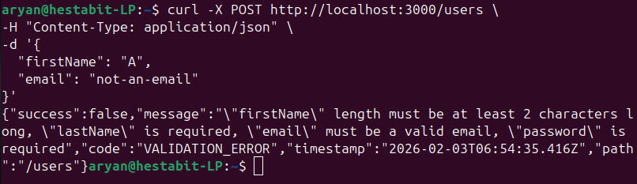
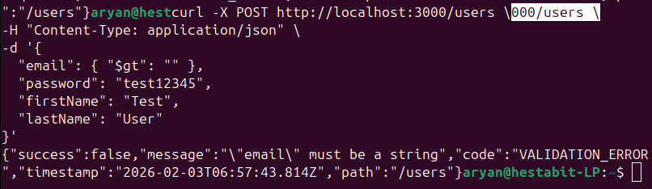
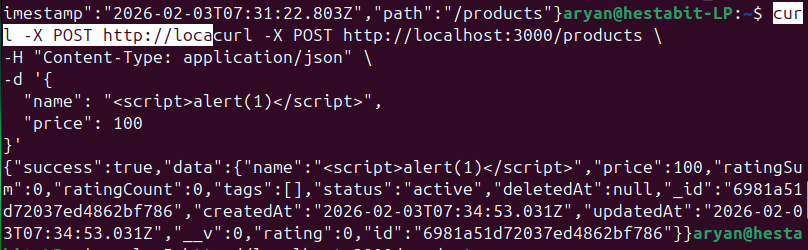
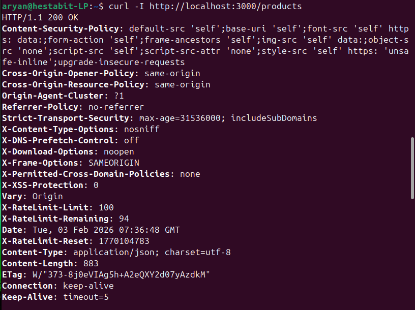
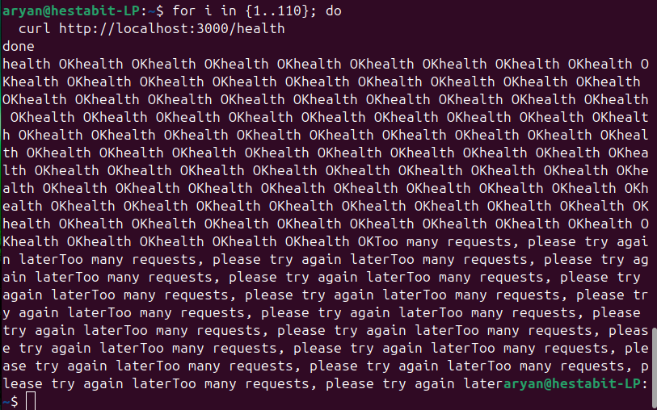
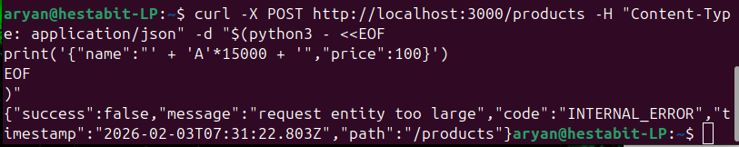
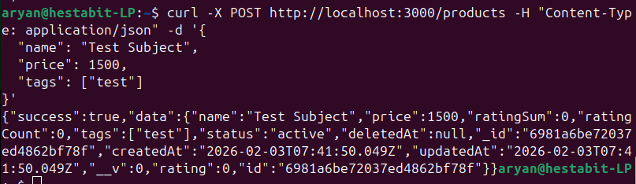
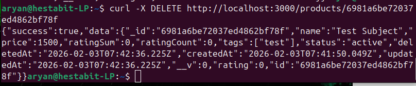
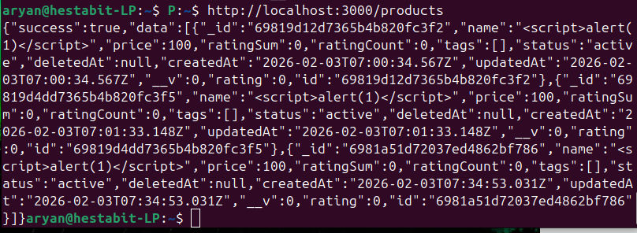
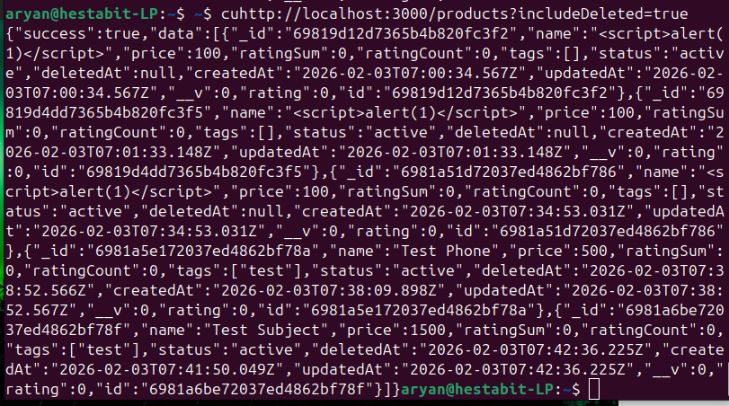

# 📌 Purpose of This Document

This Documnetation Serves as an demonstration for the Security and Validation capabilities of the project.

## Tests

### 1. Validation (Bad User Payload)

Request:
```bash
curl -X POST http://localhost:3000/users \
-H "Content-Type: application/json" \
-d '{
  "firstName": "A",
  "email": "not-an-email"
}'
```
Response:



### 2. NoSQL Injection 

Request:
```bash
curl -X POST http://localhost:3000/users \
-H "Content-Type: application/json" \
-d '{
  "email": { "$gt": "" },
  "password": "test12345",
  "firstName": "Test",
  "lastName": "User"
}'

```
Response:



### 3. XSS Payload

Request:
```bash
curl -X POST http://localhost:3000/products \
-H "Content-Type: application/json" \
-d '{
  "name": "<script>alert(1)</script>",
  "price": 100
}'
```
Response:



After Checking Headers:
Request:
```bash
curl -I http://localhost:3000/products
```
Response:



### 4. Rate Limiting

Request:
```bash
for i in {1..110}; do
  curl http://localhost:3000/health
done
```
Response:



### 5. Payload Size

Request:
```bash
curl -X POST http://localhost:3000/products \
-H "Content-Type: application/json" \
-d "$(python3 - <<EOF
print('{"name":"' + 'A'*15000 + '","price":100}')
EOF
)"
```
Response:



### 6. Soft Delete + Include Deleted

#### Added Test Product

Request:
```bash
curl -X POST http://localhost:3000/products \
-H "Content-Type: application/json" \
-d '{
  "name": "Test Subject",
  "price": 1500,
  "tags": ["test"]
}'
```
Response:



#### Deleted Product

Request:
```bash
curl -X DELETE http://localhost:3000/products/6981a6be72037ed4862bf78f
```
Response:



#### Checked products without include Deleted 

Request:
```bash
curl http://localhost:3000/products
```
Response:



#### Checked products with include Deleted 

Request:
```bash
curl http://localhost:3000/products?includeDeleted=true
```
Response:

