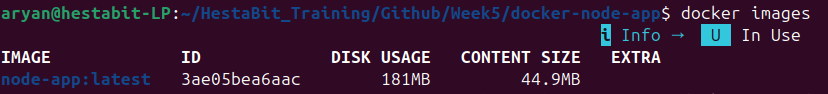
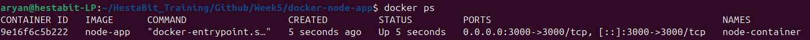
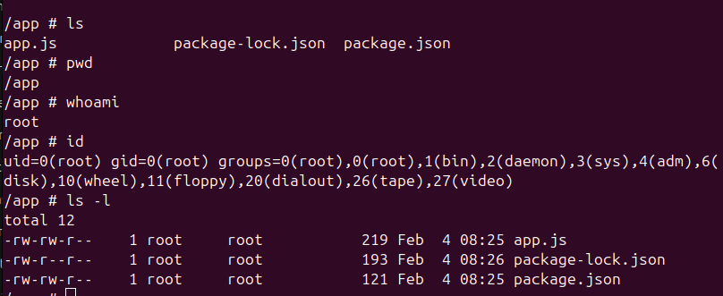
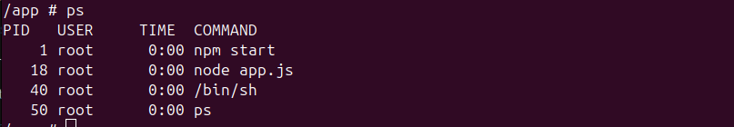
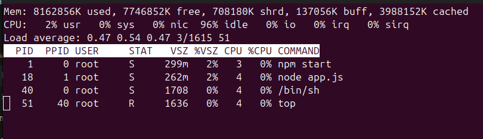
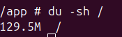
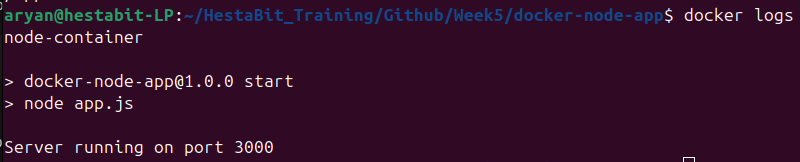
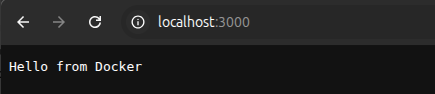

# Linux inside Docker Container
## Entering Container

Building Docker Imgae:
```bash
docker build -t node-app
```



Running Container:
```bash
docker run -d -p 3000:3000 --name node-container node-app
```



Command:
```bash
docker exec -it node-container /bin/sh
```

## Linux command Outputs:







## Docker Logs



### verification
