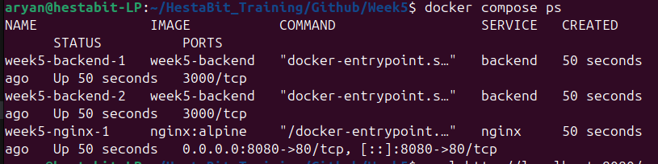
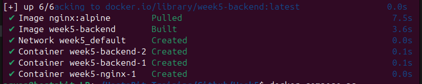
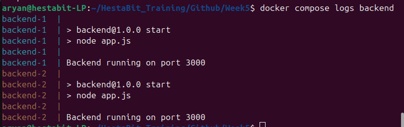
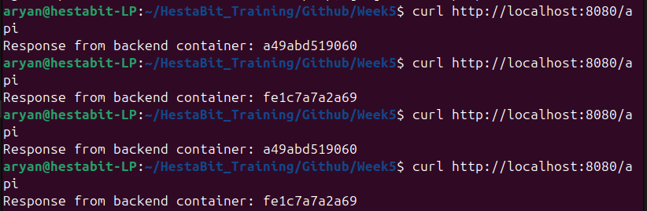
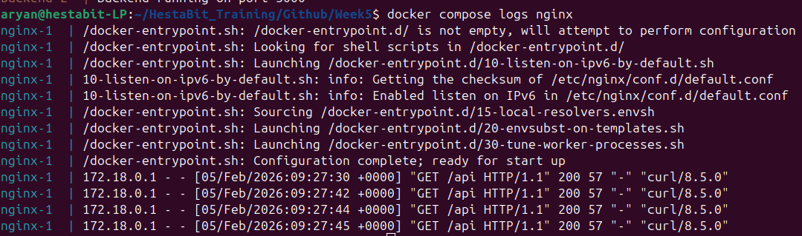

# NGINX Reverse Proxy with Load Balancing

## Architecture
- NGINX acts as reverse proxy
- Two backend Node.js containers

- Docker Compose provides networking


## Routing
- /api → backend_service:3000
- Clients never access backend directly


## Load Balancing
- Round-robin strategy
- Each request goes to a different container


## Networking
- Backend exposed only internally
- NGINX is the public entry point


## Startup
```bash
docker compose up -d
```