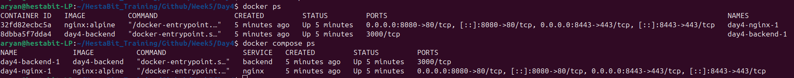
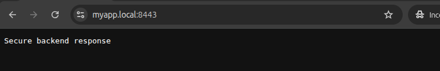
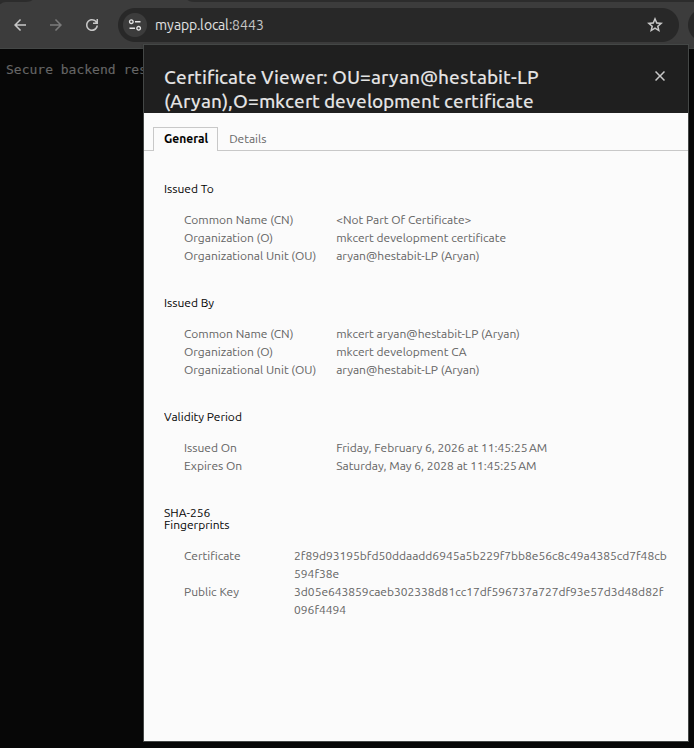

# SSL + HTTPS Setup using mkcert

## Tools Used
- mkcert for local trusted certificates
- NGINX for HTTPS termination
- Docker for containerization

## Certificate Generation
mkcert myapp.local

## HTTPS Flow
Browser → NGINX (HTTPS) → Backend (HTTP)

## Security
- SSL handled at NGINX
- Backend remains internal
- HTTP redirected to HTTPS

## Result
Local domain shows trusted lock icon

