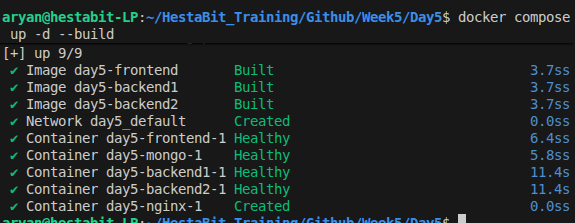
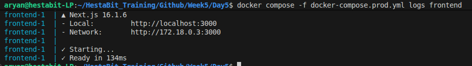
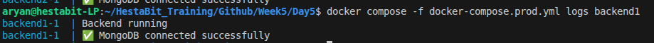
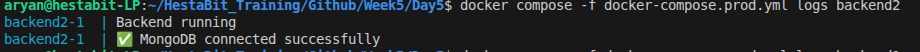
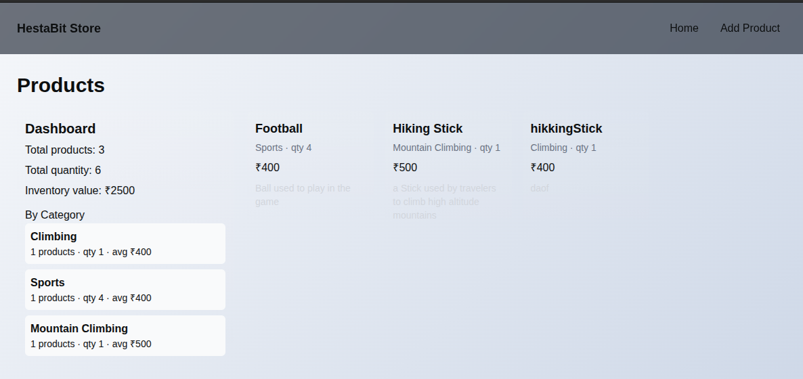
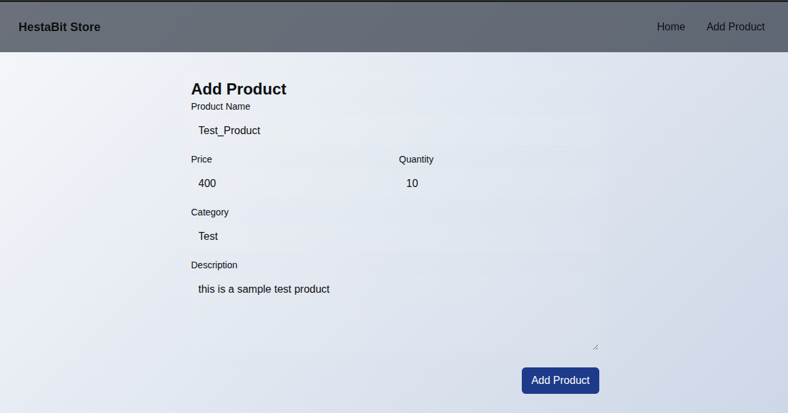

# Production Guide

This guide describes how to run and maintain the Day5 production stack for the HestaBit training project. It is written in a human-friendly style with clear steps and troubleshooting tips. Place screenshots in the spaces provided to help future readers.

---

### Overview

- Purpose: Run the frontend, two backend instances and MongoDB behind Nginx for a basic production-like setup.
- Stack: Nginx (reverse proxy), Next.js frontend, Node/Express backend x2, MongoDB (volume-backed).
- Compose file:`docker-compose.prod.yml` (production).

---

### Prerequisites

- Docker and Docker Compose installed on the host
- Port 8080 (HTTP) / 443 (HTTPS) free or adjusted in compose
- TLS certs placed in `certs/` (for HTTPS) or update `nginx/nginx.conf` to use HTTP for local testing


## Start / Restart production stack

1. Make `deploy.sh` executable if needed:

```bash
chmod +x deploy.sh
```

2. Start the production compose stack:

```bash
./deploy.sh
```

This script runs 
```bash
`docker compose -f docker-compose.prod.yml down`
```
followed by
```bash
`docker compose -f docker-compose.prod.yml up -d --build`.
```



---

## Health checks

- The compose file includes healthchecks for `mongo`, `frontend`, and backend services. Nginx is configured to wait for backend/frontend health before starting.

If a health check fails, inspect the container logs:

```bash
docker compose -f docker-compose.prod.yml logs frontend
```

```bash
docker compose -f docker-compose.prod.yml logs backend1
```

```bash
docker compose -f docker-compose.prod.yml logs backend2
```

```bash
docker compose -f docker-compose.prod.yml logs mongo
```

## Page View

### Home Page


### Add Product Page



