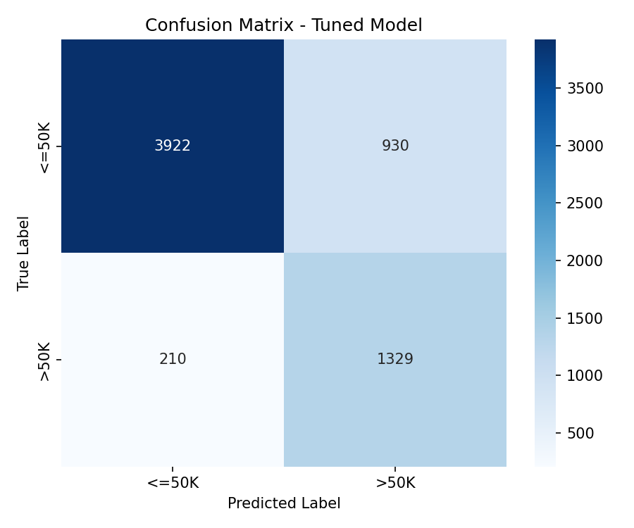
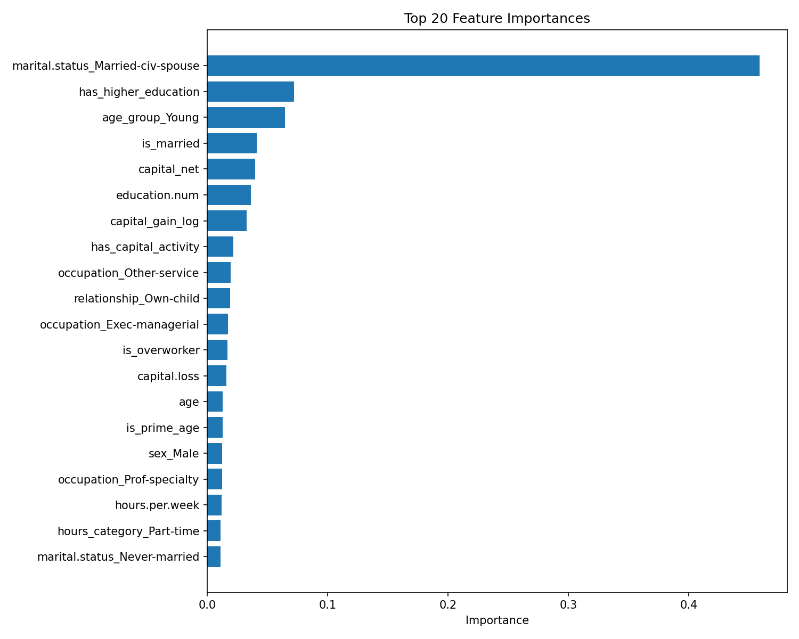
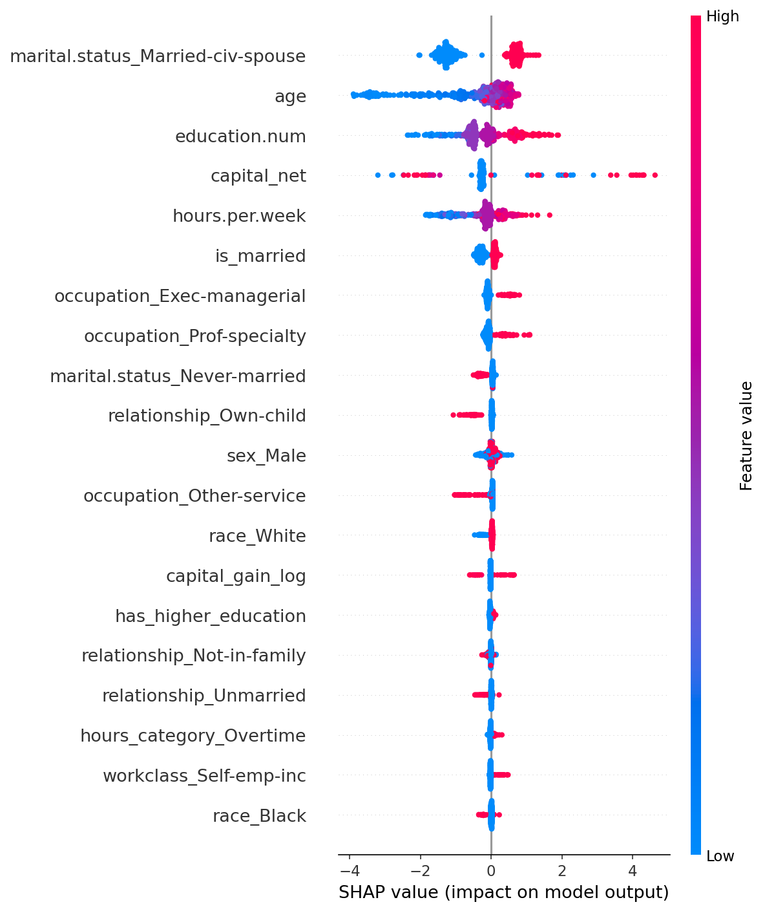

# Model Interpretation - Day 4

## Overview

This document covers hyperparameter tuning results, feature importance, SHAP analysis, and error analysis for the final XGBoost model trained on the Adult Census Income dataset.

**Final Model:** XGBoost  
**Task:** Binary Classification (<=50K vs >50K income)  
**Tuning Method:** Optuna (500 trials, 5-fold CV)  
**Optimization Metric:** F1-Score

---

## 1. Hyperparameter Tuning

### Search Space

| Parameter | Range |
|-----------|-------|
| n_estimators | 100 - 500 |
| max_depth | 3 - 10 |
| learning_rate | 0.01 - 0.3 |
| subsample | 0.6 - 1.0 |
| colsample_bytree | 0.6 - 1.0 |
| min_child_weight | 1 - 7 |
| reg_alpha | 0.0 - 1.0 |
| reg_lambda | 0.5 - 2.0 |

**Fixed:** `scale_pos_weight=3.15` (handles 76:24 class imbalance)

### Best Parameters Found

| Parameter | Value |
|-----------|-------|
| n_estimators | 314 |
| max_depth | 4 |
| learning_rate | 0.2047 |
| subsample | 0.9998 |
| colsample_bytree | 0.9100 |
| min_child_weight | 1 |
| reg_alpha | 0.1377 |
| reg_lambda | 0.8481 |

### Results

| Metric | Baseline | Tuned | Improvement |
|--------|----------|-------|-------------|
| Accuracy | 0.8221 | 0.8216 | -0.0005 |
| Precision | 0.5905 | 0.5883 | -0.0022 |
| Recall | 0.8525 | 0.8635 | +0.0110 |
| F1-Score | 0.6977 | 0.6998 | **+0.0022** |
| ROC-AUC | 0.9190 | 0.9211 | +0.0021 |

**Best CV F1:** 0.7018  
**Final model used:** Tuned

**Note:** The improvement is modest (+0.0022 F1) but the tuned model shows better Recall (+0.011) and ROC-AUC (+0.002), meaning it identifies more high-income earners correctly while maintaining overall ranking ability. Precision drops slightly as a trade-off.

### Confusion Matrix

| | Predicted <=50K | Predicted >50K |
|---|---|---|
| **Actual <=50K** | 3922 (TN) | 930 (FP) |
| **Actual >50K** | 210 (FN) | 1329 (TP) |

- **True Negative Rate (Specificity):** 3922 / (3922 + 930) = 80.8%
- **True Positive Rate (Recall):** 1329 / (1329 + 210) = 86.3%
- The model is better at catching high earners (86.3% recall) than avoiding false alarms (80.8% specificity)

---

## 2. Feature Importance

### Top 20 Features

### Top 10 Features

| Feature | Importance | Type |
|---------|------------|------|
| marital.status_Married-civ-spouse | 0.4768 | Engineered (One-Hot) |
| has_higher_education | 0.1298 | Engineered (Binary) |
| age_group_Young | 0.0433 | Engineered (One-Hot) |
| education.num | 0.0353 | Original |
| has_capital_activity | 0.0335 | Engineered (Binary) |
| capital_net | 0.0306 | Engineered (Numerical) |
| occupation_Exec-managerial | 0.0290 | Original (One-Hot) |
| occupation_Other-service | 0.0257 | Original (One-Hot) |
| is_married | 0.0256 | Engineered (Binary) |
| occupation_Prof-specialty | 0.0193 | Original (One-Hot) |

### Key Observations

- **marital.status_Married-civ-spouse** dominates with 47.7% importance — being married as a civilian spouse is by far the strongest predictor of high income in this dataset
- **7 out of top 10 features are engineered features** from Day 2, validating the feature engineering work
- **Education appears twice** — `has_higher_education` (binary) and `education.num` (ordinal) — together they hold significant weight, confirming education's importance in income prediction
- **Occupation matters** — Exec-managerial and Prof-specialty push toward >50K, while Other-service pushes toward <=50K
- Traditional capital features (capital.gain, capital.loss) don't rank as high here — `capital_net` and `has_capital_activity` (engineered) capture their signal more efficiently

---

## 3. SHAP Analysis

### What SHAP Shows

SHAP (SHapley Additive exPlanations) explains each prediction by computing how much each feature pushed the output toward >50K (positive) or <=50K (negative).

### SHAP Summary Plot (Beeswarm)

**How to read:**
- Each dot = one sample from the test set
- **X-axis:** SHAP value — positive pushes toward >50K, negative toward <=50K
- **Color:** Feature value — red = high, blue = low
- **Y-axis:** Features ranked by mean absolute SHAP value

### Observed Patterns

**Strong positive predictors (push toward >50K):**
- **marital.status_Married-civ-spouse** — Red dots (value=1, i.e. married) spread far right (+1 to +1.5 SHAP). Being married strongly increases the probability of >50K income
- **capital_net** — A few red dots extend very far right (up to +4 SHAP), indicating that individuals with high net capital are almost certainly predicted >50K
- **education.num** — Red dots (high education) lean right, blue dots (low education) lean left, showing a clear positive gradient
- **occupation_Exec-managerial / Prof-specialty** — Red dots (value=1) push right consistently

**Strong negative predictors (push toward <=50K):**
- **marital.status_Married-civ-spouse** — Blue dots (value=0, i.e. not married) cluster strongly on the left (-1 to -2 SHAP), meaning being unmarried is a strong signal for <=50K
- **age** — Blue dots (young age) spread far left (-4 SHAP range), indicating young individuals are strongly predicted <=50K. Red dots (older) are concentrated around 0
- **marital.status_Never-married** — Red dots (value=1) push left, directly opposing the married feature
- **relationship_Own-child** — Red dots push left, being someone's child strongly predicts <=50K
- **occupation_Other-service** — Red dots (value=1) push noticeably left

**Interesting patterns:**
- **is_married** and **marital.status_Married-civ-spouse** both appear — they're related but not identical, and SHAP shows both contribute independently
- **age** shows asymmetric spread — the negative (young) effect is much wider than the positive (old) effect, suggesting young age hurts income prediction more than old age helps it

---

## 4. Error Analysis

**False Positives (predicted >50K, actually <=50K):** 930  
**False Negatives (predicted <=50K, actually >50K):** 210

**Total errors:** 1,140 out of 6,391 samples (17.8% error rate)

### What the errors mean

**False Positives (930 cases):**
- Model over-predicts high income for these individuals
- Likely profile: Married individuals with decent education and occupation but moderate actual income
- The dominance of `marital.status_Married-civ-spouse` (47.7% importance) probably drives many of these — the model has learned that being married strongly implies >50K, but this doesn't hold for all married individuals

**False Negatives (210 cases):**
- Model misses actual high earners — predicts <=50K when they actually earn >50K
- Likely profile: Unmarried or young individuals with high capital activity who defy the typical demographic profile the model has learned
- These are the more costly errors in a real-world income prediction task

**FP >> FN (930 vs 210):**
- The model is tuned toward high recall (86.3%), deliberately accepting more false positives to avoid missing actual high earners
- This is a direct consequence of `scale_pos_weight=3.15` and `class_weight='balanced'` — the model was set up to prioritize finding the minority class (>50K)

---

## 5. Model Strengths and Limitations

### Strengths

- **ROC-AUC of 0.921** — excellent ranking ability; the model correctly orders 92.1% of high vs low income pairs
- **High Recall (86.3%)** — catches the majority of actual high earners, important for business use cases
- **Interpretable** — SHAP values align perfectly with domain knowledge (marriage, education, occupation, capital all known income predictors)
- **Engineered features work** — 7 of top 10 features are from Day 2 engineering, validating the pipeline

### Limitations

- **Precision at 58.8%** — out of all predicted >50K, only 58.8% are correct; significant false positive rate
- **Marital status over-reliance** — 47.7% importance on a single feature creates fragility; changes in social patterns could degrade the model
- **Modest tuning gain** — 500 Optuna trials yielded only +0.0022 F1 improvement, suggesting the baseline was already near-optimal for this dataset
- **Dataset age** — Adult Census data is from 1994; income, education, and occupation patterns have changed significantly since then

---

## 6. Files Generated

| File | Description |
|------|-------------|
| `models/tuned_model.pkl` | Final tuned XGBoost model |
| `tuning/results.json` | Tuning results, best params, baseline vs tuned metrics |
| `evaluation/confusion_matrix_tuned.png` | Confusion matrix of tuned model |
| `evaluation/feature_importance.png` | Top 20 features by XGBoost importance |
| `evaluation/shap_summary.png` | SHAP beeswarm plot |