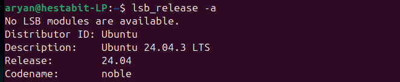
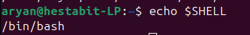
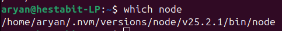
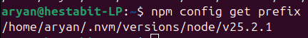
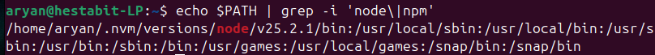

# HestaBit  
## Development Launchpad  
### Task 1  

**Submitted By:** Aryan

**Email:** aryan@hestabit.in  

---

## Identify and document

### 1. OS version
**Terminal command:**
```bash
lsb_release -a
```


**Description:** Displays detailed information about the Linux distribution currently installed on the system, including distributor ID, description, release number, and codename.

---

### 2. Current Shell
**Terminal command:**
```bash
echo $SHELL
```


**Description:** Prints the path of the default shell that is currently being used by the user (for example, bash or zsh).

---

### 3. Node binary path
**Terminal command:**
```bash
which node
```


**Description:** Shows the exact file system location of the Node.js executable that is being used when the `node` command is run.

---

### 4. NPM global installation path
**Terminal command:**
```bash
npm config get prefix
```


**Description:** Displays the directory where npm installs global packages and binaries by default.

---

### 5. PATH Entries with “node” or “npm”
**Terminal command:**
```bash
echo $PATH | grep -i 'node\|npm'
```


**Description:** Filters and displays only those entries from the system PATH environment variable that contain the words "node" or "npm", helping identify relevant executable paths.

