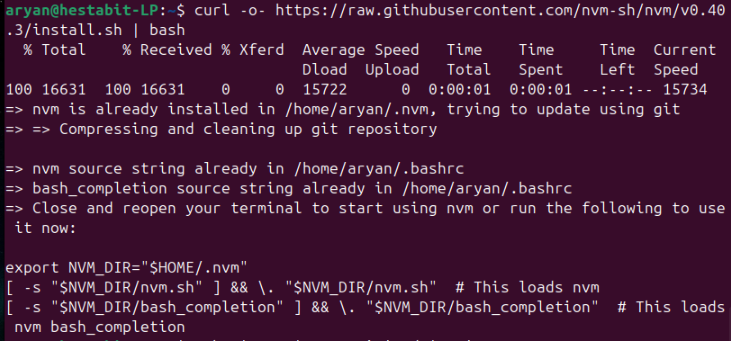
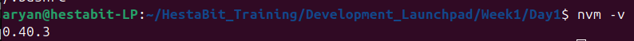
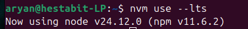

# HestaBit  
## Development Launchpad  
### Task 2  

**Submitted By:**  Aryan 
**Email:**  aryan@hestabit.in

---

## Install NVM

### 1. Download and Install NVM

**Terminal command:**
```bash
curl -o- https://raw.githubusercontent.com/nvm-sh/v0.40.3/install.sh | bash
```


**Description:** Downloads the official nvm installation script from the nvm GitHub repository and executes it to install Node Version Manager on the system.

---

### 2. Verification

**Terminal command:**
```bash
nvm -v
```


**Description:** Verifies the installation of nvm in the kernel by displaying it's version.

---

## Switch Node from LTS -> Latest and back

### 1. Installing LTS version of Node.js

**Terminal command:**
```bash
nvm install --lts
```


**Description:** Downloads and installs the latest Long Term Support (LTS) version of Node.js using nvm.

---

### 2. Using LTS

**Terminal command:**
```bash
nvm use --lts
```


**Description:** Switches the active Node.js version to the installed LTS version for the current shell session.

