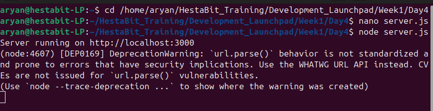
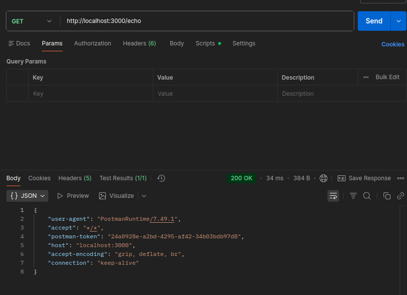
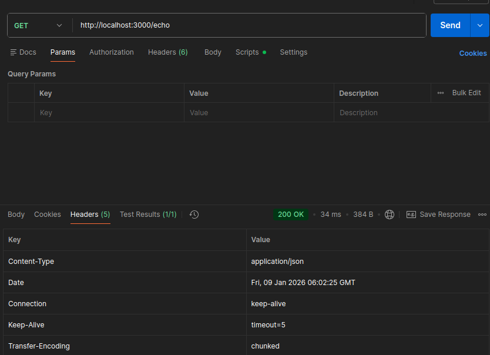
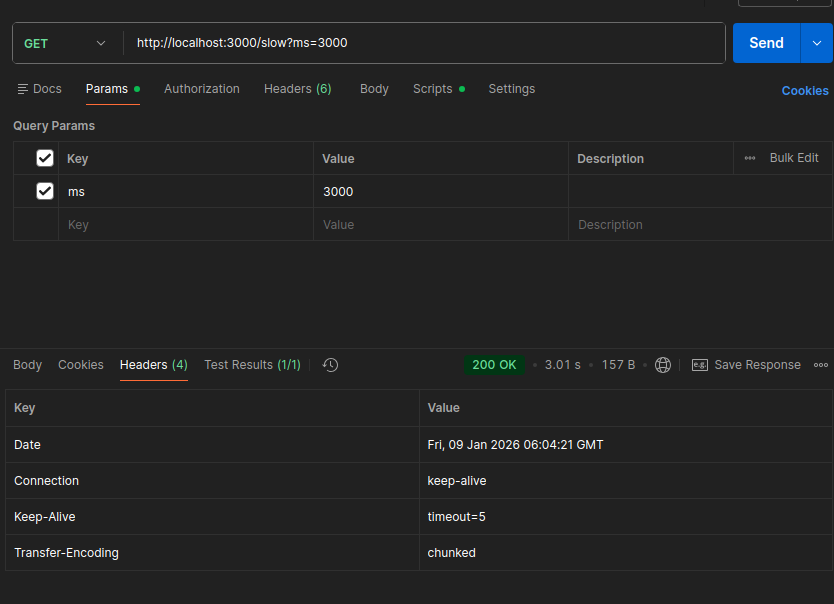
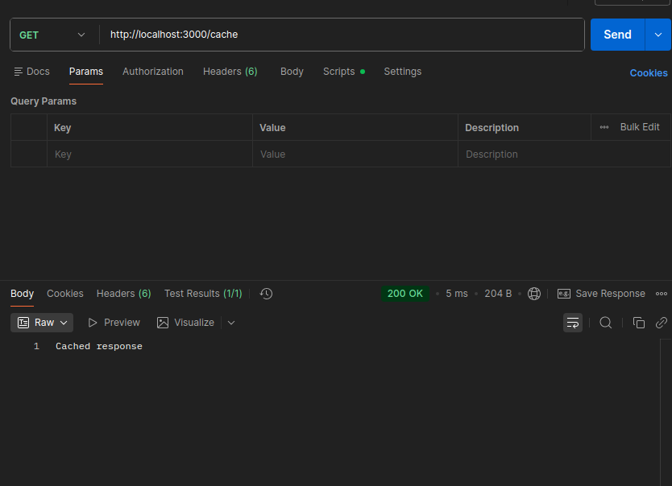
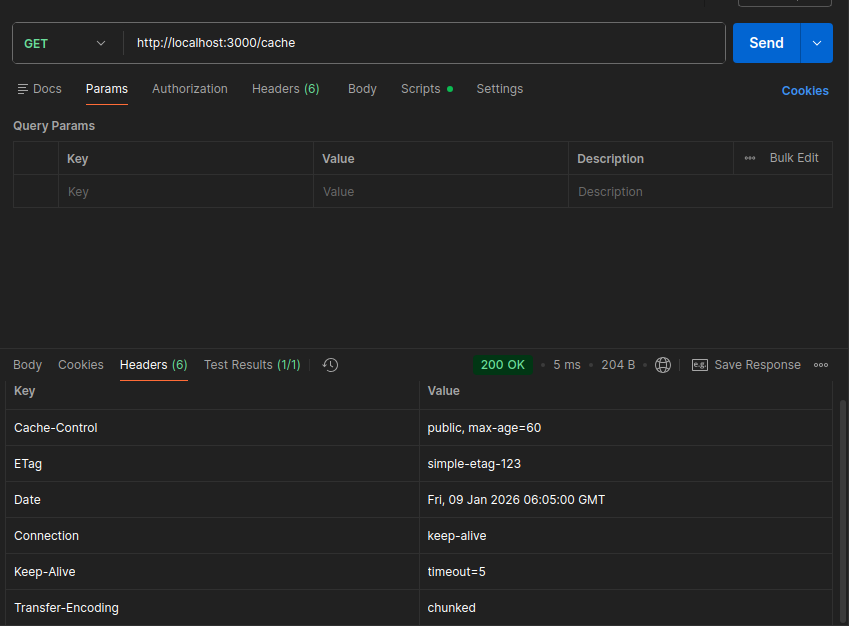

## Postman API investigation 
This documentation covers the API investigation on a server made on localhost 3000.

Server creation:

## /echo
Returned headers:

## /slow?ms=3000
delay response returned:

## /cache
Cache saved:

