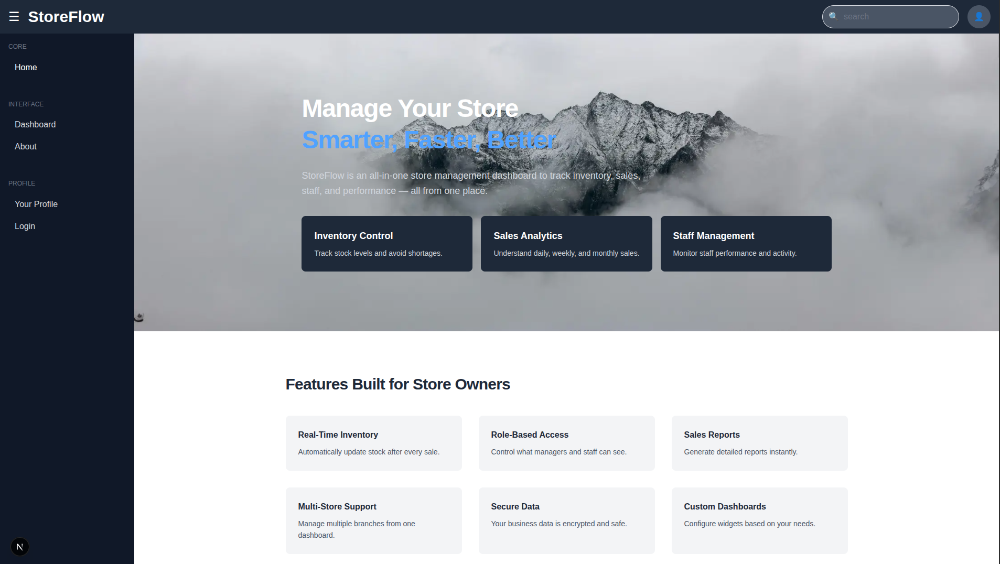
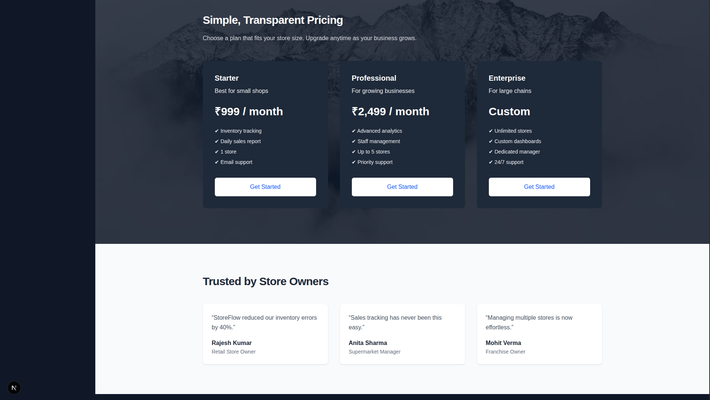
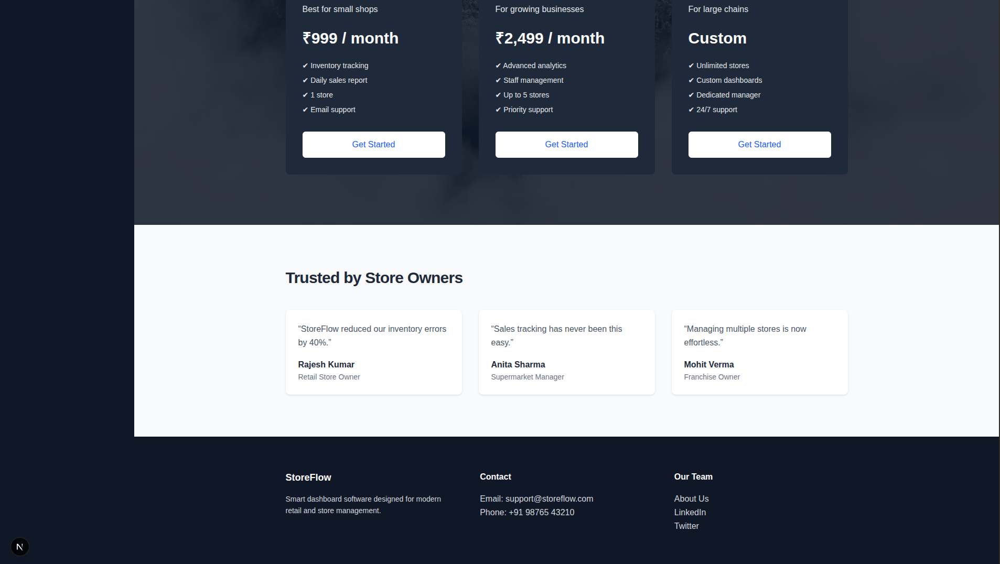
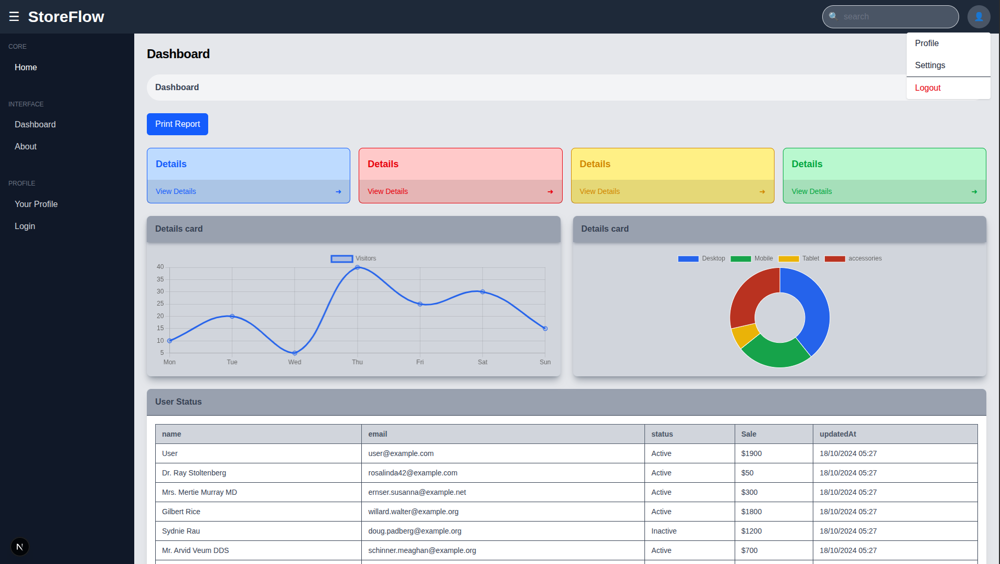
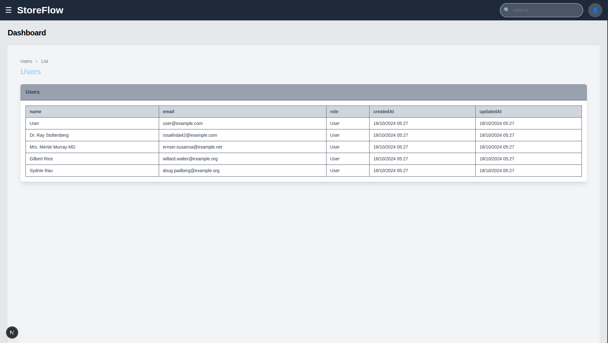
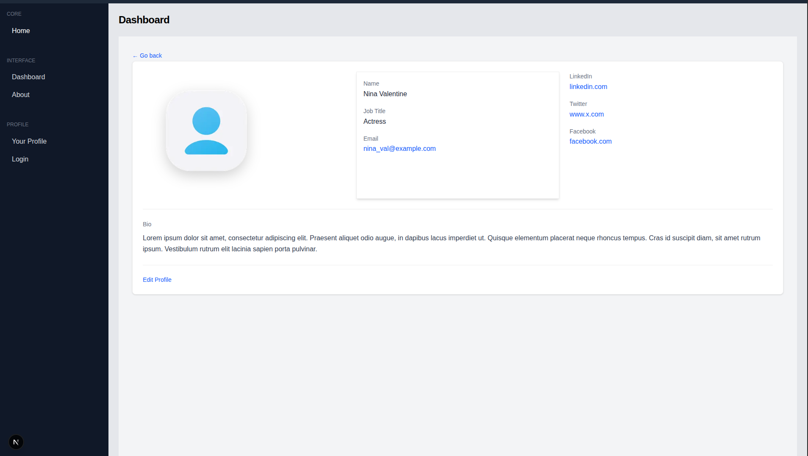
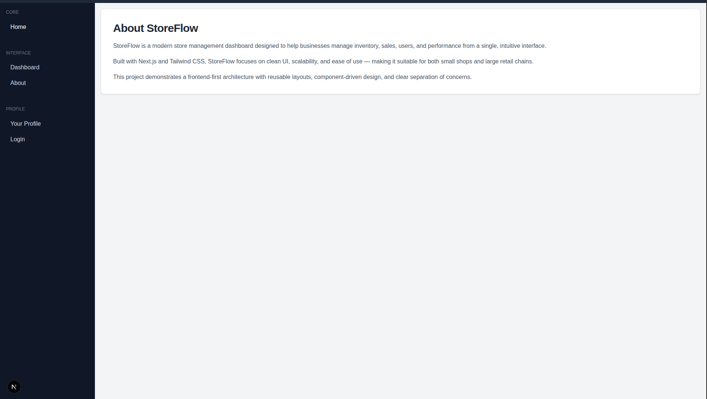

# StoreFlow – Store Management Dashboard UI

StoreFlow is a **frontend-only, multi-page dashboard UI** built using **Next.js (App Router)** and **Tailwind CSS**.  
The project focuses on clean UI architecture, reusable components, and scalable folder organization — **no backend included**.

This project is ideal for learning or demonstrating:
- Modern Next.js App Router patterns
- Dashboard UI layouts
- Component-driven design
- Mocked data handling
- Clean frontend architecture

---

## 🚀 Tech Stack

- **Next.js (App Router)**
- **React**
- **Tailwind CSS**
- **JavaScript (ES6+)**
- **Mocked Data (No Backend)**

---

## 📂 Project Folder Structure
dashboard/
├── .next/ # Next.js build output
├── node_modules/ # Dependencies
├── public/ # Static assets (images, favicon)
│
├── src/
│ ├── app/ # App Router pages & layouts
│ │ ├── about/
│ │ │ └── page.js # About page
│ │ │
│ │ ├── dashboard/
│ │ │ ├── profile/
│ │ │ │ └── page.js # Profile page
│ │ │ │
│ │ │ ├── users/
│ │ │ │ └── page.js # Users table page
│ │ │ │
│ │ │ ├── layout.js # Dashboard layout (Navbar + Sidebar)
│ │ │ └── page.js # Dashboard home page
│ │ │
│ │ ├── login/
│ │ │ └── page.js # Login page (no navbar/sidebar)
│ │ │
│ │ ├── favicon.ico
│ │ ├── globals.css # Global styles & Tailwind imports
│ │ ├── layout.js # Root layout
│ │ └── page.js # Landing page
│ │
│ ├── components/
│ │ └── ui/
│ │ ├── cards/ # Card-based UI components
│ │ │ ├── DataTableCard.jsx
│ │ │ ├── FeatureCard.jsx
│ │ │ ├── GraphCard.jsx
│ │ │ ├── HeroCard.jsx
│ │ │ ├── PricingCard.jsx
│ │ │ ├── StatCard.jsx
│ │ │ └── TestimonialCard.jsx
│ │ │
│ │ ├── Badge.jsx
│ │ ├── Button.jsx
│ │ ├── Input.jsx
│ │ ├── Modal.jsx
│ │ ├── Navbar.jsx
│ │ └── Sidebar.jsx
│ │
│ ├── data/ # Mocked data
│ │ ├── charts.js
│ │ ├── table.js
│ │ └── users.js
│ │
│ └── lib/
│ └── chart.js # Chart helpers / config
│
├── .gitignore
├── eslint.config.mjs
├── jsconfig.json
└── package.json

---

## 📄 Pages Overview

### 🔐 Login Page (`/login`)
- Static form (no authentication logic)

📸 Screenshot:


### 🏠 Landing Page (/)
- Hero section
- Feature highlights
- Pricing section
- Testimonials
- Footer

📸 Screenshot:




### 📊 Dashboard Home (/dashboard)
- Overview page for dashboard
- Uses shared dashboard layout
- Contains cards and widgets

📸 Screenshot:



### 👥 Users Page (/dashboard/users)
- Displays a user list in table format
- Uses reusable DataTableCard
- Data comes from mocked data files

📸 Screenshot:


### 👤 Profile Page (/dashboard/profile)
- User profile details
- Profile image
- Social links
- Bio section

📸 Screenshot:


### ℹ️ About Page (/about)
- Short informational page
- Describes the project purpose
- Uses the main application layout

📸 Screenshot:


### 🧩 UI Components
The project uses reusable UI components such as:
- Cards (Stats, Graphs, Tables)
- Buttons
- Inputs
- Badges
- Modal
- Navbar & Sidebar

These components are located in:
```bash
src/components/ui/
```
They are designed to be generic, reusable, and extensible.

### 📊 Mocked Data
All data is frontend-only and stored in:
```bash
src/data/
```
This allows easy replacement with real APIs in the future.
