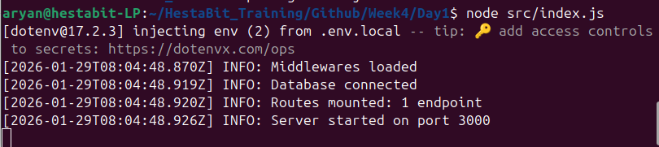
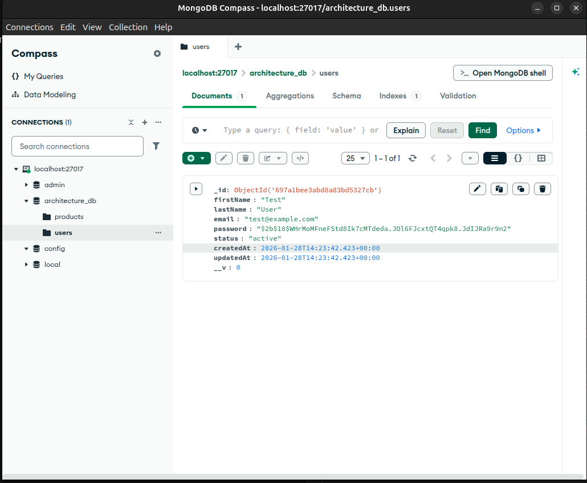

# DAY 1 — Node.js Project Architecture

## 📌 Overview
This day focuses on building a production-ready Node.js backend foundation by applying professional architectural practices.
Instead of directly implementing features, the emphasis is on project structure, controlled application startup, configuration management, and logging.

## Concepts Covered

1. Node.js Internals
- Event-driven, non-blocking I/O model
- Single-threaded execution with asynchronous callbacks
- Importance of predictable startup flow

2. Layered Architecture
- The backend follows a layered design to enforce separation of concerns and scalability.
- Request → Route → Controller → Service → Repository → Database
Each layer has a single responsibility, making the system easier to maintain and extend.

3. Environment Configuration

- Multiple environment files supported:
    .env.local
    .env.dev
    .env.prod
Centralized config loader ensures environment isolation
Sensitive values are never hard-coded

4. Logging
- Centralized logging using Winston
- Logs include timestamps and severity levels
- Startup logs provide visibility into system state

## 📁 Project Structure
```bash
src/
├── config/         # Environment and application configuration
├── loaders/        # Application startup and initialization logic
├── models/         # Database models (placeholders for now)
├── routes/         # Route definitions
├── controllers/    # HTTP request handlers
├── services/       # Business logic layer
├── repositories/   # Data access abstraction
├── middlewares/    # Express middlewares
├── utils/          # Utilities such as logger
├── jobs/           # Background jobs / schedulers
└── logs/           # Application log files
```

This structure ensures clean separation of responsibilities and prepares the application for future scaling.

## ⚙️ Application Startup Flow

The application starts in a well-defined sequence:
- Environment variables are loaded
- Logger is initialized
- Express application is created
- Middlewares are registered
- Database connection is established
- Routes are mounted
- Server begins listening on the configured port
This explicit bootstrapping avoids hidden dependencies and unpredictable behavior.




## Health Check

A basic health route is provided to verify server availability:
```bash
GET /health
```

Response:
OK


## 📦 Deliverables

src/loaders/app.js – Express bootstrapping and startup control
src/loaders/db.js – Database initialization logic
src/utils/logger.js – Centralized logging utility
.env.local - local environment file 
readme.md – Architectural overview and design rationale

## Key Takeaways

- Backend systems should be designed as systems, not scripts
- Explicit startup order improves reliability and debuggability
- Environment isolation is critical for secure deployments
- Logging is a first-class concern in production applications


# DAY 2 — Database Modeling, Indexing & Advanced CRUD 

## 📌 Overview
This day focuses on designing a robust and scalable data layer using MongoDB and Mongoose. The objective is to move beyond basic CRUD operations and implement real-world schema design, indexing strategies, and the repository pattern to support maintainable and performant backend systems.

## 🧠 Concepts Covered 

1. MongoDB & Mongoose
- MongoDB as a document-oriented NoSQL database 
- Use of Mongoose to enforce schemas, validation, and constraints 
- Lazy creation of databases and collections upon first write 

2. Schema Design Principles 
- Field validation and normalization 
- Use of timestamps for auditing 
- Embedded vs referenced schema decisions 
- Controlled data transformations 

3. Hooks & Virtual Fields 
- Pre-save hooks to preprocess data before persistence 
- Secure password hashing using bcrypt 
- Virtual fields for computed properties such as: 
      - User full name 
      - Product average rating 
Virtual fields are computed at runtime and are not stored in the database. 

4. Indexing Strategies
- Use of compound indexes to optimize common query patterns 
- Index definition: 
```bash
{ status: 1, createdAt: -1 }
```
- Understanding how indexes improve filtering and sorting performance 
- Index verification using MongoDB Compass 

5. Pagination Strategies 
- Offset-based pagination using skip and limit 
- Trade-offs between simplicity and performance 
- Awareness of cursor-based pagination for large datasets 

6. Repository Pattern 
- Centralized database access layer 
- Isolation of persistence logic from application logic 
- Improved maintainability, testability, and scalability 
Repositories expose clear methods for CRUD operations without leaking database implementation details. 

## 🧩 Models Implemented 

### User Model
- Secure password storage with hashing 
- Virtual fullName field 
- Field-level validation and normalization 
- Compound indexing for efficient queries 

### Product Model
- Pricing and rating-related fields 
- Virtual rating field computed dynamically 
- Status-based filtering support 
- Compound indexing for paginated queries 

### 📁 Key Files 
```bash
src/ 
├── models/ 
│ ├── User.js 
│ └── Product.js 
├── repositories/ 
│ ├── user.repository.js 
│ └── product.repository.js 
```
### 🧪 Verification & Analysis
- Database connection verified via application logs
User Database:

Product Database:

- Documents inserted using application logic
- Computed fields confirmed via Mongoose query results 

## 🚀 Key Takeaways 
- Proper schema design is critical for data integrity 
- Indexing significantly impacts query performance 
- Repository pattern enforces clean separation of concerns 
- Mongoose provides powerful abstractions for real-world database modeling
