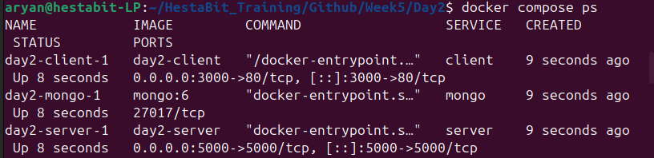
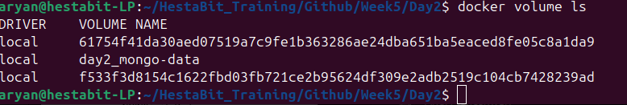
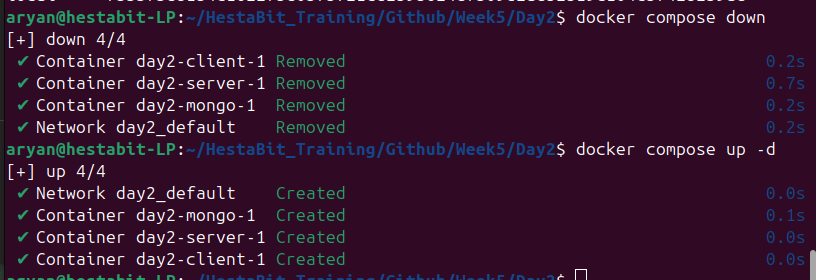
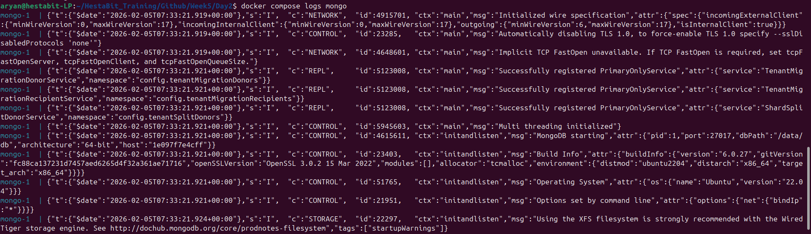
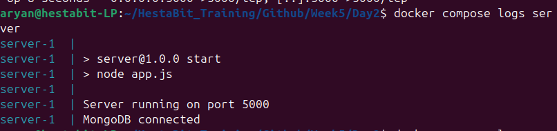

# Multi-Container Service Architecture

## Services
- Client: Nginx serving frontend

- Server: Node.js API

- Database: MongoDB


## Networking
- Docker Compose creates a private network

- Services communicate using service names
- Server connects to Mongo via `mongo:27017`

## Volumes
- mongo-data volume persists database files

- Data survives container restarts


## Logs
- Logs available via docker compose logs


- Stdout/stderr used for logging

## Startup
- Entire stack starts with:
```bash
  docker compose up -d
```