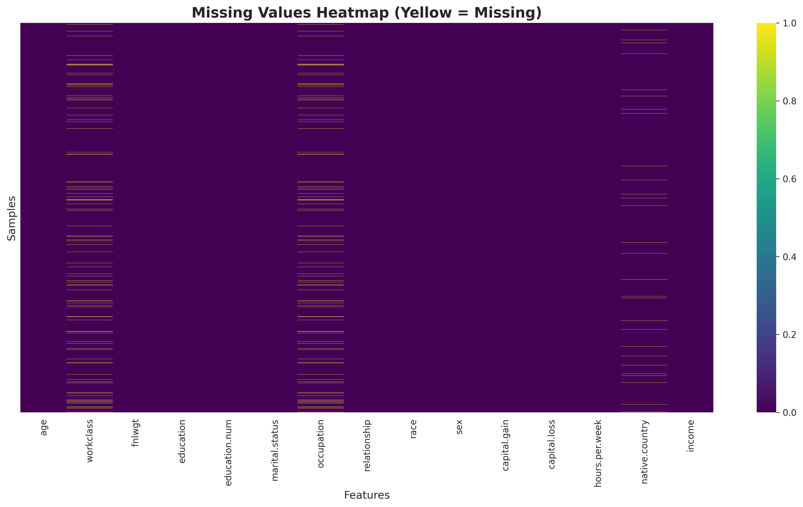
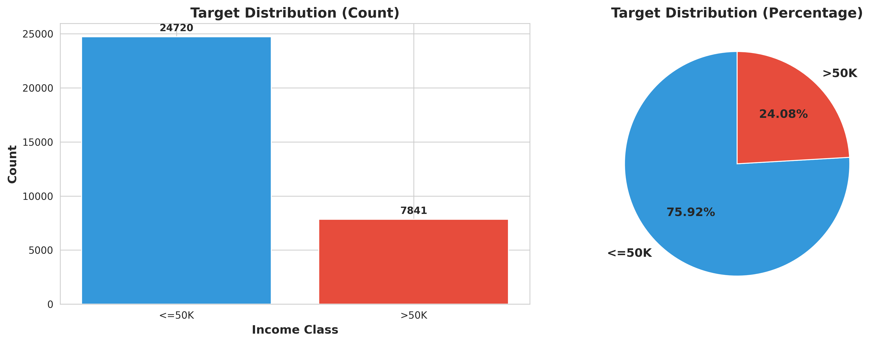
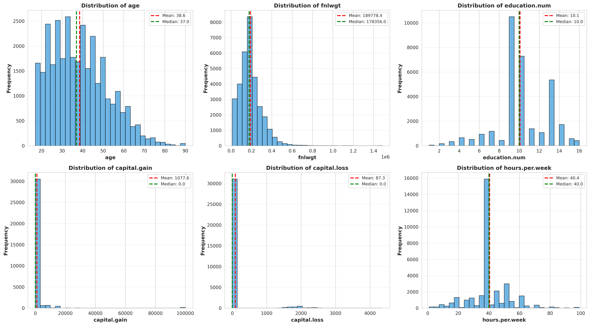
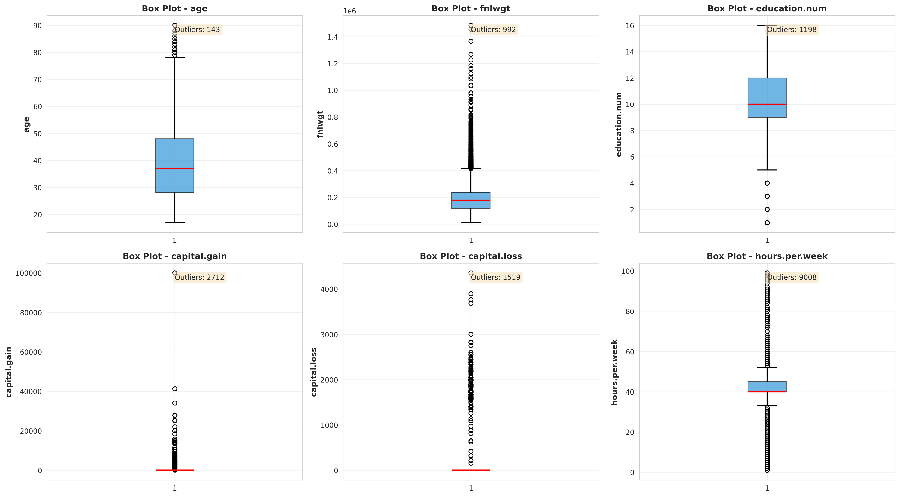
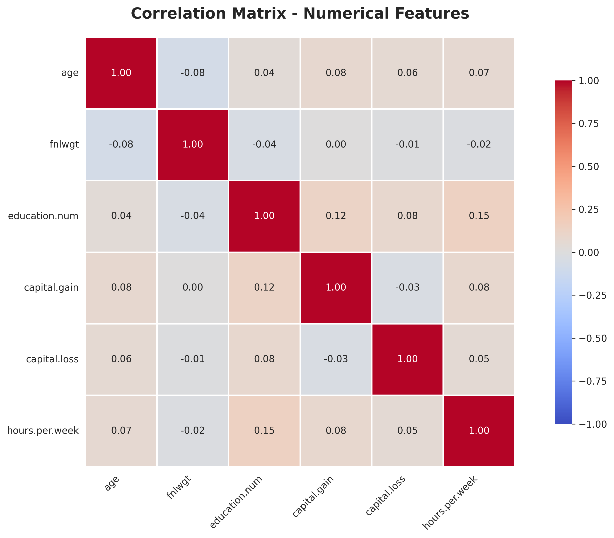
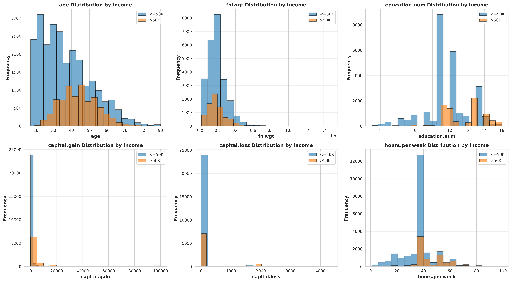
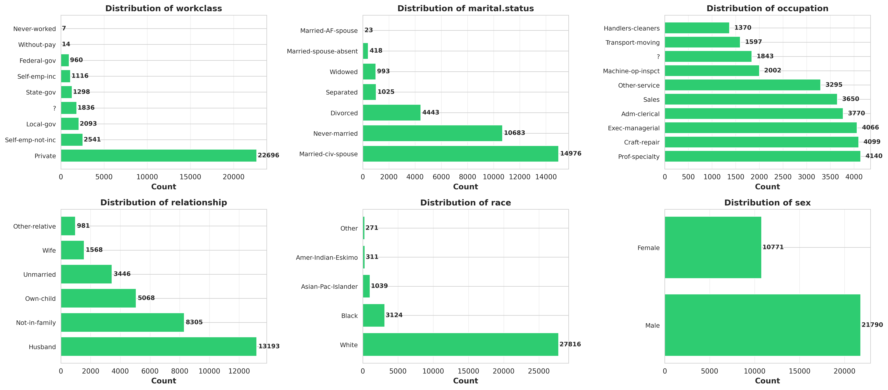
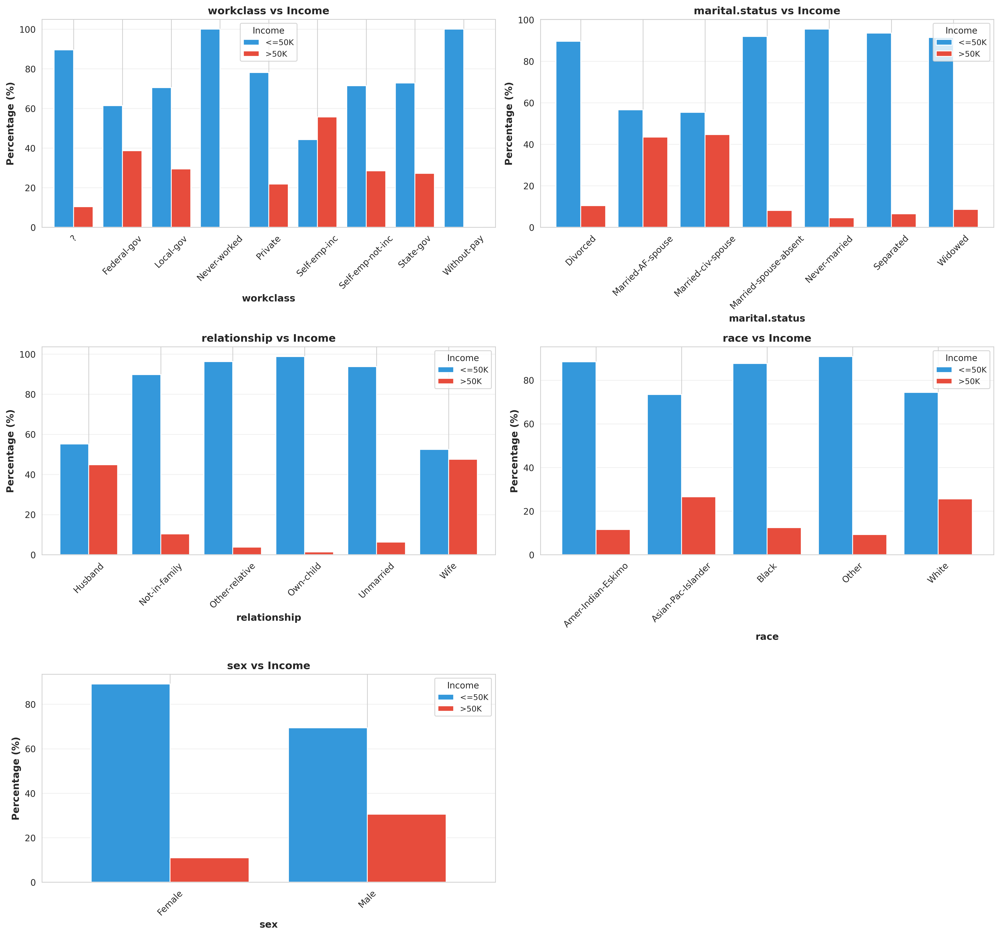
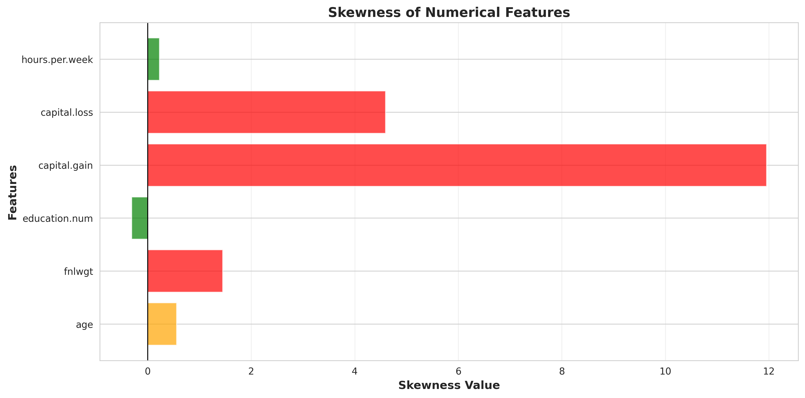

# 📊 DATA-REPORT.md

## Exploratory Data Analysis Report

**Dataset:** Adult Census Income Dataset   
**Link:**

## 1️⃣ Dataset Overview

The dataset used in this project is the Adult Census Income Dataset, commonly used for binary classification tasks.

## 🎯 Objective

Predict whether an individual earns:

- **<=50K**
- **>50K**

based on demographic and employment attributes.

## 2️⃣ Dataset Structure

- Total Records: 32,561 rows  
- Total Features: 15 columns  
- Target Variable: income

### Dataset Head  

<table border="1" class="dataframe">
  <thead>
    <tr style="text-align: right;">
      <th></th>
      <th>age</th>
      <th>workclass</th>
      <th>fnlwgt</th>
      <th>education</th>
      <th>education.num</th>
      <th>marital.status</th>
      <th>occupation</th>
      <th>relationship</th>
      <th>race</th>
      <th>sex</th>
      <th>capital.gain</th>
      <th>capital.loss</th>
      <th>hours.per.week</th>
      <th>native.country</th>
      <th>income</th>
    </tr>
  </thead>
  <tbody>
    <tr>
      <th>0</th>
      <td>90</td>
      <td>?</td>
      <td>77053</td>
      <td>HS-grad</td>
      <td>9</td>
      <td>Widowed</td>
      <td>?</td>
      <td>Not-in-family</td>
      <td>White</td>
      <td>Female</td>
      <td>0</td>
      <td>4356</td>
      <td>40</td>
      <td>United-States</td>
      <td>&lt;=50K</td>
    </tr>
    <tr>
      <th>1</th>
      <td>82</td>
      <td>Private</td>
      <td>132870</td>
      <td>HS-grad</td>
      <td>9</td>
      <td>Widowed</td>
      <td>Exec-managerial</td>
      <td>Not-in-family</td>
      <td>White</td>
      <td>Female</td>
      <td>0</td>
      <td>4356</td>
      <td>18</td>
      <td>United-States</td>
      <td>&lt;=50K</td>
    </tr>
    <tr>
      <th>2</th>
      <td>66</td>
      <td>?</td>
      <td>186061</td>
      <td>Some-college</td>
      <td>10</td>
      <td>Widowed</td>
      <td>?</td>
      <td>Unmarried</td>
      <td>Black</td>
      <td>Female</td>
      <td>0</td>
      <td>4356</td>
      <td>40</td>
      <td>United-States</td>
      <td>&lt;=50K</td>
    </tr>
    <tr>
      <th>3</th>
      <td>54</td>
      <td>Private</td>
      <td>140359</td>
      <td>7th-8th</td>
      <td>4</td>
      <td>Divorced</td>
      <td>Machine-op-inspct</td>
      <td>Unmarried</td>
      <td>White</td>
      <td>Female</td>
      <td>0</td>
      <td>3900</td>
      <td>40</td>
      <td>United-States</td>
      <td>&lt;=50K</td>
    </tr>
    <tr>
      <th>4</th>
      <td>41</td>
      <td>Private</td>
      <td>264663</td>
      <td>Some-college</td>
      <td>10</td>
      <td>Separated</td>
      <td>Prof-specialty</td>
      <td>Own-child</td>
      <td>White</td>
      <td>Female</td>
      <td>0</td>
      <td>3900</td>
      <td>40</td>
      <td>United-States</td>
      <td>&lt;=50K</td>
    </tr>
  </tbody>
</table>

## Numerical Features:
Count: 6  
Features: ['age', 'fnlwgt', 'education.num', 'capital.gain', 'capital.loss', 'hours.per.week']

## Categorical Features:
Count: 8  
Features: ['workclass', 'education', 'marital.status', 'occupation', 'relationship', 'race', 'sex', 'native.country']

## Statistical Summary

### Description

<table border="1" class="dataframe">
  <thead>
    <tr style="text-align: right;">
      <th></th>
      <th>age</th>
      <th>fnlwgt</th>
      <th>education.num</th>
      <th>capital.gain</th>
      <th>capital.loss</th>
      <th>hours.per.week</th>
    </tr>
  </thead>
  <tbody>
    <tr>
      <th>count</th>
      <td>32561.000000</td>
      <td>3.256100e+04</td>
      <td>32561.000000</td>
      <td>32561.000000</td>
      <td>32561.000000</td>
      <td>32561.000000</td>
    </tr>
    <tr>
      <th>mean</th>
      <td>38.581647</td>
      <td>1.897784e+05</td>
      <td>10.080679</td>
      <td>1077.648844</td>
      <td>87.303830</td>
      <td>40.437456</td>
    </tr>
    <tr>
      <th>std</th>
      <td>13.640433</td>
      <td>1.055500e+05</td>
      <td>2.572720</td>
      <td>7385.292085</td>
      <td>402.960219</td>
      <td>12.347429</td>
    </tr>
    <tr>
      <th>min</th>
      <td>17.000000</td>
      <td>1.228500e+04</td>
      <td>1.000000</td>
      <td>0.000000</td>
      <td>0.000000</td>
      <td>1.000000</td>
    </tr>
    <tr>
      <th>25%</th>
      <td>28.000000</td>
      <td>1.178270e+05</td>
      <td>9.000000</td>
      <td>0.000000</td>
      <td>0.000000</td>
      <td>40.000000</td>
    </tr>
    <tr>
      <th>50%</th>
      <td>37.000000</td>
      <td>1.783560e+05</td>
      <td>10.000000</td>
      <td>0.000000</td>
      <td>0.000000</td>
      <td>40.000000</td>
    </tr>
    <tr>
      <th>75%</th>
      <td>48.000000</td>
      <td>2.370510e+05</td>
      <td>12.000000</td>
      <td>0.000000</td>
      <td>0.000000</td>
      <td>45.000000</td>
    </tr>
    <tr>
      <th>max</th>
      <td>90.000000</td>
      <td>1.484705e+06</td>
      <td>16.000000</td>
      <td>99999.000000</td>
      <td>4356.000000</td>
      <td>99.000000</td>
    </tr>
  </tbody>
</table>

## Missing Value Analysis
From the Head of the Table , We found out there are many values Marked as "?" instead of Null.

<table border="1" class="dataframe">

<table border="1" class="dataframe">
  <thead>
    <tr style="text-align: right;">
      <th></th>
      <th>Null Values</th>
      <th>?</th>
      <th>Total</th>
      <th>Percentage</th>
    </tr>
  </thead>
  <tbody>
    <tr>
      <th>age</th>
      <td>0</td>
      <td>0.0</td>
      <td>0.0</td>
      <td>0.00</td>
    </tr>
    <tr>
      <th>workclass</th>
      <td>0</td>
      <td>1836.0</td>
      <td>1836.0</td>
      <td>5.64</td>
    </tr>
    <tr>
      <th>fnlwgt</th>
      <td>0</td>
      <td>0.0</td>
      <td>0.0</td>
      <td>0.00</td>
    </tr>
    <tr>
      <th>education</th>
      <td>0</td>
      <td>0.0</td>
      <td>0.0</td>
      <td>0.00</td>
    </tr>
    <tr>
      <th>education.num</th>
      <td>0</td>
      <td>0.0</td>
      <td>0.0</td>
      <td>0.00</td>
    </tr>
    <tr>
      <th>marital.status</th>
      <td>0</td>
      <td>0.0</td>
      <td>0.0</td>
      <td>0.00</td>
    </tr>
    <tr>
      <th>occupation</th>
      <td>0</td>
      <td>1843.0</td>
      <td>1843.0</td>
      <td>5.66</td>
    </tr>
    <tr>
      <th>relationship</th>
      <td>0</td>
      <td>0.0</td>
      <td>0.0</td>
      <td>0.00</td>
    </tr>
    <tr>
      <th>race</th>
      <td>0</td>
      <td>0.0</td>
      <td>0.0</td>
      <td>0.00</td>
    </tr>
    <tr>
      <th>sex</th>
      <td>0</td>
      <td>0.0</td>
      <td>0.0</td>
      <td>0.00</td>
    </tr>
    <tr>
      <th>capital.gain</th>
      <td>0</td>
      <td>0.0</td>
      <td>0.0</td>
      <td>0.00</td>
    </tr>
    <tr>
      <th>capital.loss</th>
      <td>0</td>
      <td>0.0</td>
      <td>0.0</td>
      <td>0.00</td>
    </tr>
    <tr>
      <th>hours.per.week</th>
      <td>0</td>
      <td>0.0</td>
      <td>0.0</td>
      <td>0.00</td>
    </tr>
    <tr>
      <th>native.country</th>
      <td>0</td>
      <td>583.0</td>
      <td>583.0</td>
      <td>1.79</td>
    </tr>
    <tr>
      <th>income</th>
      <td>0</td>
      <td>0.0</td>
      <td>0.0</td>
      <td>0.00</td>
    </tr>
  </tbody>
</table>

### Heatmap  

## Duplicate Value Analysis

Total Duplicate Rows: 24  
Percentage of Duplicates: 0.07%

### Sample Duplicate Records:

<table border="1" class="dataframe">
  <thead>
    <tr style="text-align: right;">
      <th></th>
      <th>age</th>
      <th>workclass</th>
      <th>fnlwgt</th>
      <th>education</th>
      <th>education.num</th>
      <th>marital.status</th>
      <th>occupation</th>
      <th>relationship</th>
      <th>race</th>
      <th>sex</th>
      <th>capital.gain</th>
      <th>capital.loss</th>
      <th>hours.per.week</th>
      <th>native.country</th>
      <th>income</th>
    </tr>
  </thead>
  <tbody>
    <tr>
      <th>8453</th>
      <td>25</td>
      <td>Private</td>
      <td>308144</td>
      <td>Bachelors</td>
      <td>13</td>
      <td>Never-married</td>
      <td>Craft-repair</td>
      <td>Not-in-family</td>
      <td>White</td>
      <td>Male</td>
      <td>0</td>
      <td>0</td>
      <td>40</td>
      <td>Mexico</td>
      <td>&lt;=50K</td>
    </tr>
    <tr>
      <th>8645</th>
      <td>90</td>
      <td>Private</td>
      <td>52386</td>
      <td>Some-college</td>
      <td>10</td>
      <td>Never-married</td>
      <td>Other-service</td>
      <td>Not-in-family</td>
      <td>Asian-Pac-Islander</td>
      <td>Male</td>
      <td>0</td>
      <td>0</td>
      <td>35</td>
      <td>United-States</td>
      <td>&lt;=50K</td>
    </tr>
    <tr>
      <th>12202</th>
      <td>21</td>
      <td>Private</td>
      <td>250051</td>
      <td>Some-college</td>
      <td>10</td>
      <td>Never-married</td>
      <td>Prof-specialty</td>
      <td>Own-child</td>
      <td>White</td>
      <td>Female</td>
      <td>0</td>
      <td>0</td>
      <td>10</td>
      <td>United-States</td>
      <td>&lt;=50K</td>
    </tr>
    <tr>
      <th>14346</th>
      <td>20</td>
      <td>Private</td>
      <td>107658</td>
      <td>Some-college</td>
      <td>10</td>
      <td>Never-married</td>
      <td>Tech-support</td>
      <td>Not-in-family</td>
      <td>White</td>
      <td>Female</td>
      <td>0</td>
      <td>0</td>
      <td>10</td>
      <td>United-States</td>
      <td>&lt;=50K</td>
    </tr>
    <tr>
      <th>15603</th>
      <td>25</td>
      <td>Private</td>
      <td>195994</td>
      <td>1st-4th</td>
      <td>2</td>
      <td>Never-married</td>
      <td>Priv-house-serv</td>
      <td>Not-in-family</td>
      <td>White</td>
      <td>Female</td>
      <td>0</td>
      <td>0</td>
      <td>40</td>
      <td>Guatemala</td>
      <td>&lt;=50K</td>
    </tr>
    <tr>
      <th>17344</th>
      <td>21</td>
      <td>Private</td>
      <td>243368</td>
      <td>Preschool</td>
      <td>1</td>
      <td>Never-married</td>
      <td>Farming-fishing</td>
      <td>Not-in-family</td>
      <td>White</td>
      <td>Male</td>
      <td>0</td>
      <td>0</td>
      <td>50</td>
      <td>Mexico</td>
      <td>&lt;=50K</td>
    </tr>
    <tr>
      <th>19067</th>
      <td>46</td>
      <td>Private</td>
      <td>173243</td>
      <td>HS-grad</td>
      <td>9</td>
      <td>Married-civ-spouse</td>
      <td>Craft-repair</td>
      <td>Husband</td>
      <td>White</td>
      <td>Male</td>
      <td>0</td>
      <td>0</td>
      <td>40</td>
      <td>United-States</td>
      <td>&lt;=50K</td>
    </tr>
    <tr>
      <th>20388</th>
      <td>30</td>
      <td>Private</td>
      <td>144593</td>
      <td>HS-grad</td>
      <td>9</td>
      <td>Never-married</td>
      <td>Other-service</td>
      <td>Not-in-family</td>
      <td>Black</td>
      <td>Male</td>
      <td>0</td>
      <td>0</td>
      <td>40</td>
      <td>?</td>
      <td>&lt;=50K</td>
    </tr>
    <tr>
      <th>20507</th>
      <td>19</td>
      <td>Private</td>
      <td>97261</td>
      <td>HS-grad</td>
      <td>9</td>
      <td>Never-married</td>
      <td>Farming-fishing</td>
      <td>Not-in-family</td>
      <td>White</td>
      <td>Male</td>
      <td>0</td>
      <td>0</td>
      <td>40</td>
      <td>United-States</td>
      <td>&lt;=50K</td>
    </tr>
    <tr>
      <th>22783</th>
      <td>19</td>
      <td>Private</td>
      <td>138153</td>
      <td>Some-college</td>
      <td>10</td>
      <td>Never-married</td>
      <td>Adm-clerical</td>
      <td>Own-child</td>
      <td>White</td>
      <td>Female</td>
      <td>0</td>
      <td>0</td>
      <td>10</td>
      <td>United-States</td>
      <td>&lt;=50K</td>
    </tr>
    <tr>
      <th>22934</th>
      <td>19</td>
      <td>Private</td>
      <td>146679</td>
      <td>Some-college</td>
      <td>10</td>
      <td>Never-married</td>
      <td>Exec-managerial</td>
      <td>Own-child</td>
      <td>Black</td>
      <td>Male</td>
      <td>0</td>
      <td>0</td>
      <td>30</td>
      <td>United-States</td>
      <td>&lt;=50K</td>
    </tr>
    <tr>
      <th>23276</th>
      <td>49</td>
      <td>Private</td>
      <td>31267</td>
      <td>7th-8th</td>
      <td>4</td>
      <td>Married-civ-spouse</td>
      <td>Craft-repair</td>
      <td>Husband</td>
      <td>White</td>
      <td>Male</td>
      <td>0</td>
      <td>0</td>
      <td>40</td>
      <td>United-States</td>
      <td>&lt;=50K</td>
    </tr>
    <tr>
      <th>23660</th>
      <td>25</td>
      <td>Private</td>
      <td>195994</td>
      <td>1st-4th</td>
      <td>2</td>
      <td>Never-married</td>
      <td>Priv-house-serv</td>
      <td>Not-in-family</td>
      <td>White</td>
      <td>Female</td>
      <td>0</td>
      <td>0</td>
      <td>40</td>
      <td>Guatemala</td>
      <td>&lt;=50K</td>
    </tr>
    <tr>
      <th>23720</th>
      <td>44</td>
      <td>Private</td>
      <td>367749</td>
      <td>Bachelors</td>
      <td>13</td>
      <td>Never-married</td>
      <td>Prof-specialty</td>
      <td>Not-in-family</td>
      <td>White</td>
      <td>Female</td>
      <td>0</td>
      <td>0</td>
      <td>45</td>
      <td>Mexico</td>
      <td>&lt;=50K</td>
    </tr>
    <tr>
      <th>23827</th>
      <td>49</td>
      <td>Self-emp-not-inc</td>
      <td>43479</td>
      <td>Some-college</td>
      <td>10</td>
      <td>Married-civ-spouse</td>
      <td>Craft-repair</td>
      <td>Husband</td>
      <td>White</td>
      <td>Male</td>
      <td>0</td>
      <td>0</td>
      <td>40</td>
      <td>United-States</td>
      <td>&lt;=50K</td>
    </tr>
    <tr>
      <th>26738</th>
      <td>23</td>
      <td>Private</td>
      <td>240137</td>
      <td>5th-6th</td>
      <td>3</td>
      <td>Never-married</td>
      <td>Handlers-cleaners</td>
      <td>Not-in-family</td>
      <td>White</td>
      <td>Male</td>
      <td>0</td>
      <td>0</td>
      <td>55</td>
      <td>Mexico</td>
      <td>&lt;=50K</td>
    </tr>
    <tr>
      <th>27133</th>
      <td>28</td>
      <td>Private</td>
      <td>274679</td>
      <td>Masters</td>
      <td>14</td>
      <td>Never-married</td>
      <td>Prof-specialty</td>
      <td>Not-in-family</td>
      <td>White</td>
      <td>Male</td>
      <td>0</td>
      <td>0</td>
      <td>50</td>
      <td>United-States</td>
      <td>&lt;=50K</td>
    </tr>
    <tr>
      <th>28796</th>
      <td>27</td>
      <td>Private</td>
      <td>255582</td>
      <td>HS-grad</td>
      <td>9</td>
      <td>Never-married</td>
      <td>Machine-op-inspct</td>
      <td>Not-in-family</td>
      <td>White</td>
      <td>Female</td>
      <td>0</td>
      <td>0</td>
      <td>40</td>
      <td>United-States</td>
      <td>&lt;=50K</td>
    </tr>
    <tr>
      <th>29051</th>
      <td>42</td>
      <td>Private</td>
      <td>204235</td>
      <td>Some-college</td>
      <td>10</td>
      <td>Married-civ-spouse</td>
      <td>Prof-specialty</td>
      <td>Husband</td>
      <td>White</td>
      <td>Male</td>
      <td>0</td>
      <td>0</td>
      <td>40</td>
      <td>United-States</td>
      <td>&gt;50K</td>
    </tr>
    <tr>
      <th>29334</th>
      <td>39</td>
      <td>Private</td>
      <td>30916</td>
      <td>HS-grad</td>
      <td>9</td>
      <td>Married-civ-spouse</td>
      <td>Craft-repair</td>
      <td>Husband</td>
      <td>White</td>
      <td>Male</td>
      <td>0</td>
      <td>0</td>
      <td>40</td>
      <td>United-States</td>
      <td>&lt;=50K</td>
    </tr>
    <tr>
      <th>29604</th>
      <td>38</td>
      <td>Private</td>
      <td>207202</td>
      <td>HS-grad</td>
      <td>9</td>
      <td>Married-civ-spouse</td>
      <td>Machine-op-inspct</td>
      <td>Husband</td>
      <td>White</td>
      <td>Male</td>
      <td>0</td>
      <td>0</td>
      <td>48</td>
      <td>United-States</td>
      <td>&gt;50K</td>
    </tr>
    <tr>
      <th>31060</th>
      <td>46</td>
      <td>Private</td>
      <td>133616</td>
      <td>Some-college</td>
      <td>10</td>
      <td>Divorced</td>
      <td>Adm-clerical</td>
      <td>Unmarried</td>
      <td>White</td>
      <td>Female</td>
      <td>0</td>
      <td>0</td>
      <td>40</td>
      <td>United-States</td>
      <td>&lt;=50K</td>
    </tr>
    <tr>
      <th>32065</th>
      <td>19</td>
      <td>Private</td>
      <td>251579</td>
      <td>Some-college</td>
      <td>10</td>
      <td>Never-married</td>
      <td>Other-service</td>
      <td>Own-child</td>
      <td>White</td>
      <td>Male</td>
      <td>0</td>
      <td>0</td>
      <td>14</td>
      <td>United-States</td>
      <td>&lt;=50K</td>
    </tr>
    <tr>
      <th>32419</th>
      <td>35</td>
      <td>Private</td>
      <td>379959</td>
      <td>HS-grad</td>
      <td>9</td>
      <td>Divorced</td>
      <td>Other-service</td>
      <td>Not-in-family</td>
      <td>White</td>
      <td>Female</td>
      <td>0</td>
      <td>0</td>
      <td>40</td>
      <td>United-States</td>
      <td>&lt;=50K</td>
    </tr>
  </tbody>
</table>

## Target Variable Analysis

<table border="1" class="dataframe">
  <thead>
    <tr style="text-align: right;">
      <th></th>
      <th>Class</th>
      <th>Count</th>
      <th>Percentage</th>
    </tr>
  </thead>
  <tbody>
    <tr>
      <th>0</th>
      <td>&lt;=50K</td>
      <td>24720</td>
      <td>75.919044</td>
    </tr>
    <tr>
      <th>1</th>
      <td>&gt;50K</td>
      <td>7841</td>
      <td>24.080956</td>
    </tr>
  </tbody>
</table>

⚠️ Class Imbalance Ratio: 3.15:1

## Numerical Features Analysis

### Distribution

### Box Plot For Outlier Detection

### Correlation Matrix

### Numerical Features vs Target

## Categorical Features Analysis

### Distribution

<table border="1" class="dataframe">
  <thead>
    <tr style="text-align: right;">
      <th></th>
      <th>Feature</th>
      <th>Unique_Values</th>
      <th>Most_Common</th>
      <th>Most_Common_Count</th>
    </tr>
  </thead>
  <tbody>
    <tr>
      <th>0</th>
      <td>workclass</td>
      <td>9</td>
      <td>Private</td>
      <td>22696</td>
    </tr>
    <tr>
      <th>1</th>
      <td>education</td>
      <td>16</td>
      <td>HS-grad</td>
      <td>10501</td>
    </tr>
    <tr>
      <th>2</th>
      <td>marital.status</td>
      <td>7</td>
      <td>Married-civ-spouse</td>
      <td>14976</td>
    </tr>
    <tr>
      <th>3</th>
      <td>occupation</td>
      <td>15</td>
      <td>Prof-specialty</td>
      <td>4140</td>
    </tr>
    <tr>
      <th>4</th>
      <td>relationship</td>
      <td>6</td>
      <td>Husband</td>
      <td>13193</td>
    </tr>
    <tr>
      <th>5</th>
      <td>race</td>
      <td>5</td>
      <td>White</td>
      <td>27816</td>
    </tr>
    <tr>
      <th>6</th>
      <td>sex</td>
      <td>2</td>
      <td>Male</td>
      <td>21790</td>
    </tr>
    <tr>
      <th>7</th>
      <td>native.country</td>
      <td>42</td>
      <td>United-States</td>
      <td>29170</td>
    </tr>
  </tbody>
</table>

### Categorical Features vs Target

## Skewness Analysis

<table border="1" class="dataframe">
  <thead>
    <tr style="text-align: right;">
      <th></th>
      <th>Feature</th>
      <th>Skewness</th>
      <th>Interpretation</th>
    </tr>
  </thead>
  <tbody>
    <tr>
      <th>0</th>
      <td>age</td>
      <td>0.558743</td>
      <td>Right Skewed</td>
    </tr>
    <tr>
      <th>1</th>
      <td>fnlwgt</td>
      <td>1.446980</td>
      <td>Highly Right Skewed</td>
    </tr>
    <tr>
      <th>2</th>
      <td>education.num</td>
      <td>-0.311676</td>
      <td>Symmetric</td>
    </tr>
    <tr>
      <th>3</th>
      <td>capital.gain</td>
      <td>11.953848</td>
      <td>Highly Right Skewed</td>
    </tr>
    <tr>
      <th>4</th>
      <td>capital.loss</td>
      <td>4.594629</td>
      <td>Highly Right Skewed</td>
    </tr>
    <tr>
      <th>5</th>
      <td>hours.per.week</td>
      <td>0.227643</td>
      <td>Symmetric</td>
    </tr>
  </tbody>
</table>

# Final Analysis

## Missing Value Analysis
There are no such missing values in the Data , instead some entries in the **"workclass"**, **"occupation"** and **"native.country"** have **"?"**.

- **"?"** in **"workclass"** and **"occupation"** is converted to **"unkown"** class , to preserve data.
- The rows with **"?"** entries in **"native.country"** feature is removed.

## Duplicated Data

There were **24** duplicated rows , all are removed.

## Outlier Analysis

Outliers were found in multiple Features, such as:  
- education.num
- capital.gain
- capital.loss
- hours.per.week

Since **capital.gain** and **capital.loss** consist of mainly **0s** , decided to leave them , will handle them Feature Engineering using Lo Transformation.

