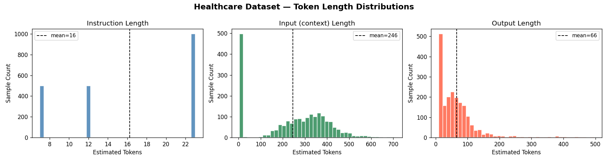
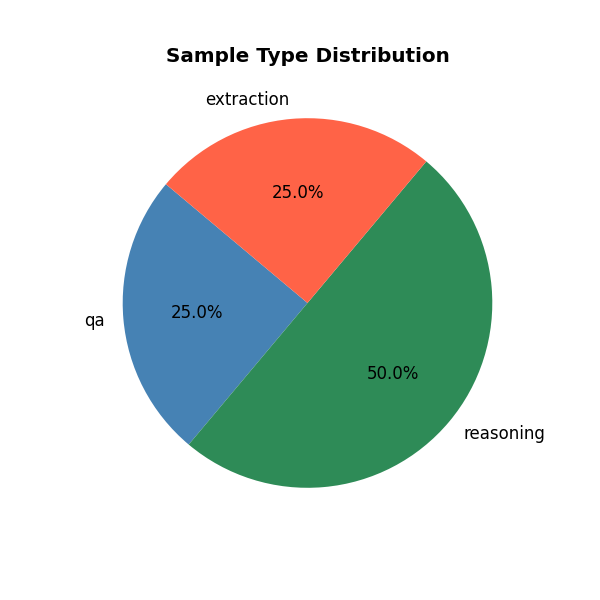

# DATASET-ANALYSIS.md
## Week 8 — Healthcare Instruction Tuning Dataset

---

## Overview

| Property | Value |
|----------|-------|
| Domain | Healthcare / Medical |
| Total samples | 2000 |
| Train split | ~90% |
| Val split | ~10% |
| Format | JSONL `{"instruction", "input", "output"}` |

---

## Dataset Sources

| Type | HuggingFace Dataset | Description |
|------|---------------------|-------------|
| **QA** | `medalpaca/medical_meadow_medqa` | USMLE-style medical exam Q&A. Only samples with full explanatory answers retained (~2,184 of 10,176). Single-letter MCQ answers (`"A"`, `"B"`) discarded as they carry no training signal. |
| **Reasoning** | `qiaojin/PubMedQA` (`pqa_labeled`) | PubMed abstract reasoning. Input = abstract context, output = yes/no/maybe + long explanation. |
| **Extraction** | `medalpaca/medical_meadow_wikidoc_patient_information` | Patient-facing medical text. Instruction = extraction prompt, output = structured medical facts. |

---

## Why These Datasets

- All three are **publicly available** on HuggingFace — no token or login required
- Together they cover **three distinct output styles**: short factual answers, multi-sentence reasoning, and structured extraction — which forces the model to learn generalised instruction following rather than one pattern
- All are **domain-consistent** (Healthcare) so the fine-tuned model develops coherent medical language understanding

---

## Key Dataset Decision: medqa Filtering

The `medical_meadow_medqa` dataset contains 10,176 samples but ~7,992 of them are single-letter MCQ answers structured like:

```
output: "A"
output: "B. Penicillin"
output: "The answer is (C)"
```

These were **intentionally discarded** because:
1. A model that learns `question → "B"` learns nothing generalisable
2. They have fewer than 20 alphabetic characters — failing the content quality check
3. The remaining 2,184 samples have full medical explanations and are far more valuable

We only need 500 QA samples, so 2,184 is more than sufficient.

---

## Type Distribution

| Type | Raw Samples | After Cleaning | Final Sampled |
|------|------------|----------------|---------------|
| QA | 10,178 | ~2,186 | 500 | 
| Reasoning | 1,000 | 1,000 | 1000 |
| Extraction | 5,942 | 5808 | 500 |
| **Total** | | | **2,000** |

---

## Cleaning Pipeline (`utils/data_cleaner.py`)

Steps applied in order to every sample:

**1. Text Normalisation**
- Strip HTML tags (`<b>`, `<br>` etc.)
- Collapse whitespace and newlines
- Fix Unicode encoding artifacts (smart quotes, apostrophes)

**2. Length Filtering**
- Output tokens < 10 → removed (`output_too_short`)
- Output tokens > 512 → removed (`output_too_long`)
- Instruction tokens > 256 → removed (`instruction_too_long`)
- Token count estimated as `len(text) // 4` (standard GPT-style approximation)

**3. Content Quality Check** *(applied to Reasoning + Extraction only)*
- Outputs with fewer than 20 alphabetic characters → removed (`output_not_text`)
- Catches pure punctuation, numbers, or symbol-only outputs
- Skipped for QA (`skip_text_check=False`) — the length filter alone is sufficient

**4. Deduplication**
- Exact match on `(instruction.lower(), output.lower())`
- Removes copy-paste duplicates common in scraped medical datasets

---

## Cleaning Stats (

### Cleaning QA
  
Stats: {'removed_output_too_short': 7992, 'passed': 2186, 'removed_duplicate': 12}

### Cleaning Reasoning
Stats: {'passed': 1000, 'removed_duplicate': 0}

### Cleaning Extraction
Stats: {'passed': 5808, 'removed_output_too_long': 84, 'removed_output_too_short': 50, 'removed_duplicate': 310}

---

## Token Length Analysis

Token count estimated using: `tokens ≈ len(text) / 4`

### Distribution Plots

**Output Token Length Distribution (all 3 types)**



---

**Sample Type Distribution**



---

### Summary Stats Table (fill in after running notebook)

| Type | Mean Tokens | Min | Max | p95 |
|------|-------------|-----|-----|-----|
| QA |14 |10 |47 |23 |
| Reasoning |70 |18 |209 |124 |
| Extraction |110 |10 |496 |362 |

---

## Outlier Removal Rationale

| Threshold | Value | Reason |
|-----------|-------|--------|
| Min output tokens | 10 | Outputs < ~40 chars carry no training signal |
| Max output tokens | 512 | Outputs > ~2,000 chars cause OOM on T4 during QLoRA training |
| Max instruction tokens | 256 | Longer instructions typically indicate data pipeline errors |
| Min alphabetic chars | 20 | Catches numeric-only or symbol-heavy outputs (Reasoning + Extraction only) |

---

